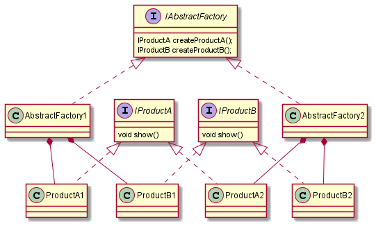

# DesignPatternLib独立Module  
 常用设计模式简单例子   

## 面向对象基础特性  

### 抽象、封装、继承、多态

## 设计原则  

### 1.封装变化

找出应用中可能需要**变化**之处，把它**独立**出来，并**封装**起来，不要和那些不需要变化的代码混在一起。

以便以后可以**轻易地改动或扩充**此部分，而不影响不需要变化的其他部分，从而使系统变得更有**弹性**。

### 2.合成复用原则：多用组合，少用继承

“有一个”可能比“是一个”更好，使用**组合**建立系统具有很大的**弹性**，可以在运行时**动态地改变行为**，只要组合的对象符合正确的接口标准即可。

### 3.针对接口编程，不针对实现编程（策略模式）

针对接口编程，可以在运行时**动态地改变行为**，而不需要修改客户端代码，使系统更有**弹性**。

### 4.为交互对象之间的松耦合设计而努力（观察者模式）

当两个对象松耦合，它们**依然可以交互**，但是**不太清楚彼此的细节**。

可以**独立地复用**其中的一个对象，并且可以改变其中一个，并不会影响另一方，只要它们之间的**接口仍被遵守**。

这使得系统更具**弹性**，能够**应对变化**。

### 5.开闭原则：类应该对扩展开放，对修改关闭（装饰者模式）  

目标是允许类**容易扩展**，在**不修改现有代码**的情况下，就可**搭配新的行为**。

遵循开闭原则，通常会引入新的抽象层次，增加代码复杂度，因此，应该在**最有可能改变**的地方应用，不能滥用。

### 6.依赖倒置原则：依赖抽象，不用依赖具体类（抽象工厂模式）  

跟“**针对接口编程，不针对实现编程**”相似，但这里更强调**抽象**。

不能让高层组件依赖低层组件，而且，不管高层或低层组件，都应该依赖于**抽象**。

从客户端代码调用框架代码，变成框架调用客户端代码。**框架来定义接口，客户端来实现。**

### 7.最少知识原则（迪米特法则）：只和你的朋友交谈（外观模式、中介者模式）  

不要让太多的类耦合在一起，免得修改系统中的一部分，会影响到其他部分。  

就任何对象而言，我们只应该调用属于以下范围的方法：

- 该对象本身
- 被当做方法参数传进来的对象
- 此方法创建或实例化的任何对象
- 对象的任何组件（成员变量对象）

### 8.好莱坞原则：别调用我们，我们会调用你（模板方法模式）

允许低层组件将自己挂钩到系统上，但是高层组件会决定什么时候和怎么样使用这些低层组件。

跟依赖倒置原则还是有区别的：依赖倒置原则更多是说，我们应该面向接口编程；好莱坞原则是说，低层组件将自己挂钩到系统上，由系统来主动调用。

### 9.单一责任原则：一个类应该只有一个引起变化的原因

## 创建型模式  

### 1.单例模式 Singleton Pattern    

四种类型：饿汉模式、**懒汉模式**（线程不安全）、**双重锁懒汉模式**（多线程推荐该模式）、静态内部类模式。  

#### 定义  

确保一个类只有一个实例，并提供一个全局访问点。

#### JDK中的应用   

- Runtime：通过`Runtime.getRuntime()`使用的是饿汉模式

### 2.工厂模式 Factory Pattern    

三种类型：简单工厂模式、工厂方法模式、抽象工厂模式

#### 定义  

- 简单工厂模式：直接定义一个方法，来实例化对象。
- 工厂方法模式：定义了一个创建对象的接口，里面定义一个方法，即**工厂方法**，但由**子类**决定要实例化的是哪一个类。工厂方法让类把实例化推迟到子类。
- 抽象工厂模式：提供一个接口，里面有一系列的**工厂方法**，用于创建相关或依赖对象的**家族**，而不需要明确指定具体类。

#### JDK中的应用 

#### 相关设计原则  

- 依赖倒置原则：依赖抽象，不用依赖具体类

#### 类图

### 3.建造者模式 Builder Pattern   

#### 定义

#### JDK中的应用 

#### 相关设计原则

#### 类图 

### 4.原型模式 Prototype Pattern  

#### 定义

#### JDK中的应用 

#### 相关设计原则

## 结构型模式  

### 5.代理模式 Proxy Pattern  

#### 定义

#### JDK中的应用 

#### 相关设计原则

#### 类图

### 6.适配器模式 Adapter Pattern    

两种类型：  类适配器模式、对象适配器模式

#### 定义  

将一个类的接口，转换成客户期望的另一个接口。适配器让原本接口不相容的类可以合作无间。

#### JDK中的应用 

#### 相关设计原则  

#### 类图

- 类适配器模式  

- 对象适配器模式

  

### 7.桥接模式 Bridge Pattern  

#### 定义

#### JDK中的应用 

#### 相关设计原则

#### 类图 

### 8.装饰模式 Decorator Pattern  

#### 定义

动态地将责任附加到对象上，若要**扩展功能**，装饰者提供了比继承更有弹性的替代方案。

#### JDK中的应用   

- InputStream作为抽象组件，FilterInputStream作为抽象装饰者。FileInputStream、ObjectInputStream等继承InputStream作为具体的组件，BufferedInputStream、LineNumberInputStream等继承FilterInputStream作为具体的装饰者。如`new  BufferedInputStream(new FileInputStream())`

#### 相关设计原则  

- 开闭原则：类应该对扩展开放，对修改关闭

#### 类图 

### 9.外观模式 Facade Pattern  

#### 定义  

提供了一个**统一的接口**，用来访问子系统中的**一群接口**。外观定义了一个高层接口，让子系统更容易使用。

#### JDK中的应用  

#### 相关设计原则  

- 最少知识原则：只和你的朋友交谈

#### 类图 

### 10.享元模式 Flyweight Pattern  

#### 定义

#### JDK中的应用 

#### 相关设计原则

#### 类图 

### 11.组合模式 Composite Pattern  

#### 定义  

允许你将对象组合成树形结构来表现“整体/部分”层次结构。组合能让客户以**一致的方式**处理个别对象以及对象组合。

#### JDK中的应用 

#### 相关设计原则

- **违背**单一责任原则，要管理层次结构，还要执行叶子节点的操作；但换取到了**透明性**，客户可以将组合和叶节点一视同仁。这是一个**折衷**的案例。

#### 类图 

## 行为型模式  

### 12.模板方法模式 Template Method Pattern  

#### 定义  

在一个方法（模板方法）中定义一个**算法骨架**，而将一些步骤**延迟到子类**中。模板方法使得子类可以在不改变算法结构的情况下，重新定义算法的某些步骤。

#### JDK中的应用 

- Arrays.sort()：sort()为模板方法，定义了排序算法，但里面的具体排序规则是Comparable.compareTo()方法，该方法由排序的元素去实现。（该方法不是严格意义上的模板方法模式，它没有使用子类继承，但思想一样，用一个类的方法填补模板方法中的一个方法的实现）。
- InputStream.read()：该方法是由子类（如FileInputStream、ObjectInputStream等）去实现的，而这个方法又会被read(byte b[], int off, int len)模板方法调用。

#### 相关设计原则  

- 好莱坞原则：别调用我们，我们会调用你

### 13.策略模式 Strategy Pattern  

#### 定义  

定义了算法族，分别封装起来，让它们之间可以互相替换，此模式让算法的变化独立于使用算法的客户。

#### JDK中的应用   

ThreadPoolExecutor中的四种拒绝策略，RejectedExecutionHandler的实现类AbortPolicy、CallerRunsPolicy、DiscardOldestPolicy、DiscardPolicy。

#### 相关设计原则

- 封装变化
- 多用组合，少用继承
- 针对接口编程，不针对实现编程

#### 类图

### 14.命令模式 Command Pattern  

#### 定义  

将**“请求”封装成对象**，以便使用不同的请求来**参数化**其他对象。命令模式也可用来实现队列、日志和支持撤销的操作。  

命令对象将对象和接受者包进对象中，这个对象只暴露一个`execute()`方法，当此方法调用时，接收者就会执行这些动作。

#### JDK中的应用 

#### 相关设计原则

#### 类图

### 15.责任链模式 Chain of Responsibility Pattern  

#### 定义

#### JDK中的应用 

#### 相关设计原则

#### 类图 

### 16.状态模式 State Pattern  

#### 定义  

允许对象在内部状态改变时，改变它的行为，对象看起来好像修改了它的类。  

这个模式将状态**封装**成独立地类，并将动作**委托**到代表当前状态的对象，然后**行为**会随着内部状态改变而**改变**。

#### JDK中的应用   

- Thread的状态

#### 相关设计原则  

- 封装变化
- 开闭原则
- 单一责任

#### 类图 

### 17.观察者模式 Observer Pattern

#### 定义

定义了对象之间的**一对多**依赖，这样一来，当一个对象改变状态时，它的所有依赖者都会收到通知并自动更新。

#### JDK中的应用   

Observer 与 Observable两个类。Observer类可以看作是抽象观察者角色，而Observable是抽象主题角色。 

#### 相关设计原则

- 封装变化
- 多用组合，少用继承
- 针对接口编程，不针对实现编程
- 为交互对象之间的松耦合设计而努力

#### 类图 

### 18.中介者模式 Mediator Pattern  

#### 定义

#### JDK中的应用 

#### 相关设计原则

#### 类图 

### 19.迭代器模式 Iterator Pattern  

#### 定义  

提供一种方法顺序访问一个聚合对象中的各个元素，而又不暴露其内部的表示。

#### JDK中的应用   

- ArrayList、HashSet的`iterator()`返回的就是一个迭代器`Iterator`
- ArrayList的`ListIterator()`返回的也是一个迭代器`listIterator`，它比`Iterator`多了向前遍历的方法`previous()`
- Vector、HashTable的`elements()`返回的也是一个迭代器`Enumeration`

#### 相关设计原则  

- 封装变化（封装了遍历）
- 针对接口编程，不针对实现编程
- 单一责任原则（迭代器负责遍历，聚合类负责管理对象集合）

#### 类图 

### 20.访问者模式 Visitor Pattern  

#### 定义

#### JDK中的应用 

#### 相关设计原则

#### 类图 

### 21.备忘录模式 Memento Pattern  

#### 定义

#### JDK中的应用 

#### 相关设计原则

#### 类图 

### 22.解释器模式 Interpreter Pattern  

#### 定义

#### JDK中的应用 

#### 相关设计原则

#### 类图 

##  设计模式比较  

### 1.装饰者、适配器、外观  

- 相似点：结构上都是都是通过包装已经存在的类，来实现一些新的功能或操作。
- 不同点：3者主要的区别在于**意图**不同，装饰者不改变接口，但加入新的责任；适配器将一个接口转变成另一个接口；外观简化接口，并将客户端从子系统中解耦。

### 2.工厂方法、模板方法、策略  

- 相似点：结构类似，都是将某些操作延迟到子类或其他类（策略模式）中，让子类自己实现某个功能。工厂方法是模板方法的一种特殊版本。策略和模板方法都封装算法，一个用组合，一个用继承。
- 不同点：3者主要的区别在于**意图**不同，工厂方法由子类决定实例化哪个具体的类（产品）；模板方法让子类决定如何实现算法中的某些步骤；策略封装可互换的一组算法，然后使用委托来决定采用哪一个算法。

### 3.状态、策略

- 相似点：类图、结构基本一样。
- 不同点：
  -  **意图**不同：**策略模式**是为了解决**继承**带来的行为被固定的问题，通过**组合**不同的对象来改变context的行为；**状态模式**是为了解决**许多条件判断**的问题，通过将状态包装进状态对象中，可以在Context内**改变状态对象**，来改变context的行为。  
  - **使用方式**不同：**策略模式**客户通常**主动**指定context对象要组合的策略对象是哪一个，对某一个context对象来说，通常只有**一个**最适合的策略对象；**状态模式**将一群行为封装在状态对象中，context当前状态会在**状态对象集合**中**游走改变**，context的行为也会随之改变，但context的客户对于**状态对象**了解不多，甚至根本是**浑然不觉**。

