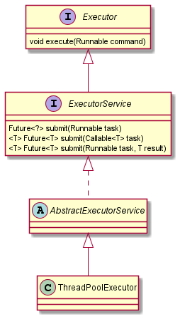
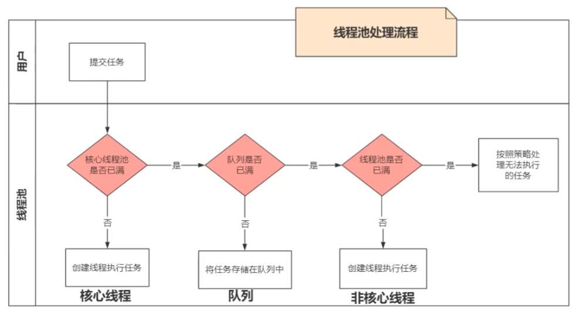

# Android Note  

1. Intent可以传递的数据类型：基本数据、String、CharSequence、序列化对象，以及他们的**数组**和**Array List**。
2. SparseArray：  
    - **android特有**，在数据量少（源码里写的几百个，实际测试小于2.5万左右SparseArray快，否则HashMap快）、key为int类型时，代替HashMap可以减少**内存**占用，
    - 内部维护**两个数组**，一个int数组保存key值（**有序**的，二分查找的前提），一个Object数组保存value值。
    - **remove()**:不会真正删除，只是做了**标记**，值设为 DELETED，只有执行gc()时才会**回收**，整理数组。
    - **put()**:根据key值，通过**二分查找**找到对应位置，如果该位置上已经有值或被标记为 DELETED，就更新，否则gc()整理数组，重新找位置，再插入。
    - **get()**:根据key值，通过**二分查找**找到对应位置，再根据位置取得对应的值。
    - **扩容**：默认**初始容量10**，超出当前大小，扩容为**2倍**。
3. ArrayMap：基本跟SparseArray类似，主要区别在于：
    - key值可以是**任意类型**，而SparseArray的key值只能是**int类型**，但也因此SparseArray没有装箱、计算hashCode等操作，效率更高。
    - 内部也维护了**两个数组**，但其中的int数组不是直接保存key值，而是对应的**hashCode**。
    - **扩容**：默认**初始容量0**，超出当前大小，扩容为**1.5倍**。
4. HashMap：
    - **put**节点，JDK1.8之前头插，JDK1.8开始，尾插，改成尾插的原因：头插法在**多线程**扩容的时候会造成**链表环**。1.8还加入了**红黑树**，在链表个数**大于8**时使用，提高get的效率。
    - **hash函数**：(n - 1) & hash，在n为**2的n次方**时，产生hash**冲突的概率最低**（这也是HashMap初始默认容量为16，**扩容为2倍的原因**）。这种情况概率低的原因是：此时（n - 1）的二进制表示每位都是1，1&0 = 0,1&1 = 1，而如果二进制位上是0的话，0&0 = 0，0&1 = 0，就冲突了。
    - **线程不安全**：HashTable和ConcurrentHashMap是线程安全的，HashTable是将put和get方法都加synchronized，ConcurrentHashMap是在这两个方法里对当前操作的链表加synchronized，因此只有put和get操作的链表相同时，锁才会生效，这样效率会更高。
    - **扩容**：默认**初始容量16**，超出**当前大小*加载因子**（默认0.75），扩容为**2倍**。
5. Dialog的创建必须使用**Activity**的Context不能使用Application的，因为Dialog必须在Activity上创建，属于Activity的一部分，这也是弹Dialog，**不会走**Activity的**onPause**方法的原因。
6. 默认情况下，一个应用所有的组件都运行在同一个进程的同一个线程（main线程）里。
7. 进程的5级优先级：前台进程、可见进程、服务进程、后台进程、空进程。
8. 装箱、拆箱：
9. 强软弱虚引用：
    - 强引用：只用引用断开（**设为null**），对象才能被回收
    - 软引用：**内存不足**时，gc会回收，通常用于**缓存**
    - 弱引用：只要**gc**，对象就会被回收，防止**内存泄漏**，JDK中的应用**ThreadLocal**
    - 虚引用：管理**堆外内存**，gc回收时会将该对象的一些信息，放到一个queue里，gc线程会遍历这个queue，拿到信息后就会删除对应的堆外内存
10. ThreadLocal：
    - set(T value)：
      - 首先获取到**当前线程**的ThreadLocal.ThreadLocalMap成员变量，然后将当前**ThreadLocal对象作为key**，传进来的value作为value，保存到线程的map对象里。
      - 所以value其实是set到了当前线程的map对象里，因此与线程**绑定**在一起了，不会影响其他线程。
      - 这个map对象，里面其实是一个**数组**，存放的是ThreadLocalMap.Entry对象，Entry对象继承WeakReference<ThreadLocal<?>>，弱引用指向的是ThreadLocal对象，还有一个成员变量，保存value。
    - get()：
      - 首先也是获取到当前线程的map对象，然后以当前ThreadLocal对象作为key，获取到对应的value。
    - remove()：
      - 从map中移除当前ThreadLocal对象作为key的Entry。
      - ThreadLocal对象不再使用时，一定要调用remove方法，否则会造成内存泄漏。（虽然key是弱引用，内存不足时会回收，但是不remove的话，entry会一直在map里，对应的value对象内存泄漏）
11. Handler原理：
   - Looper.prepare()
     * new了一个Looper对象，并在Looper的构造方法里，创建了MessageQueue对象
     * 将创建的Looper对象通过ThreadLocal与当前线程绑定
   - new Handler()
     * 通过Looper类中的ThreadLocal获取到prepare()中绑定的Looper对象
     * 然后通过Looper对象，获取到MessageQueue的引用
   - handler.sendMessage(msg)
     * 设置msg.target = this(即调用sendMessage方法的handler对象)
     * 把msg添加到MessageQueue中
   - Looper.loop()
     * 开启死循环，不断的从MessageQueue中获取Message
     * 获取到msg对象后，通过msg.target拿到发送该msg的Handler对象
     * 然后调用handler的dispatchMessage，在该方法里会回调handleMessage方法
11. 子线程**不能更新UI**的原因：更新的时候会走View.requestLayout方法，最后调到ViewRootImpl.checkThread，在该方法中会判断当前线程是否是主线程，若不是则抛出异常CalledFromWrongThreadException。因此在某些情况下（更新不会导致requestLayout调用、ViewRootImpl还没创建等），**checkThread**没有走到，更新UI就不会抛异常，如ProgressBar。当然开发过程中还是要注意在主线程去更新UI。

12. 子线程**不能弹Toast**的原因：在Toast的构造方法里，会去调用Looper.myLooper()，获取到loop对象，若**loop为null**则抛出异常。因此，若在子线程主动调用Looper.prepare()之后，弹toast，并在最后调Looper.loop()，也是能正常弹出toast，但一般不建议这么做。至于loop的用处，是用来创建handler对象，toast显示其实也是通过handler发消息。

13. 子线程**不能创建Handler**的原因：这个原因其实与不能弹Toast一样，也是因为没有调用Looper.prepare()，**loop对象为空**，抛出异常。

14. 动态代理：

    - 在调用`Proxy.newProxyInstance()`之前，设置一个属性`System.getProperties().put("sun.misc.ProxyGenerator.saveGeneratedFiles", "true");`之后就能看到生成的代理类的class文件了，该类**继承Proxy**，并**实现代理的接口**。
    - 从该文件中可以看到，它还自动添加了Object类的`equals()`、`toString()`、`hashCode()`3个方法，以及代理的接口中的所有方法。并且调用这些方法，都是转交给**InvocationHandler的`invoke()`方法**处理。

15. 统计：友盟
    retrofit：反射、动态代理
    IntentService：任务执行完毕，自动结束service
     lock锁、semaphore、CountDownLatch、阻塞队列BlockingQueue

    启动流程
    binder通信
    打包
    builder模式，url创建
    viewpager 适配器模式
    适配器模式，playinfo

## 多线程  

### 1. 线程的基本方法

- start()：启动线程，新起一个线程执行run方法，不能直接调run()，否则还是在当前线程里。
- sleep(long millis)：休眠一定时间，该期间不会获得CPU。
- yield()：放弃CPU，回到ready状态，其他线程可竞争CPU。
- join()：在一个线程里调用另一个线程的join()，会先去执行另一个线程，执行完了，再返回当前线程。

### 2. 线程的状态


### 3. synchronized

- 是可重入的
- 抛异常会自动释放锁
- 锁升级过程：
  - 无锁：刚**new**出来，还**没有**线程访问
  - 偏向锁：有**一个**线程访问，升级为偏向锁，在被锁对象的对象头的markword，记录这个线程id。
  - 自旋锁：有**多个**线程争用，升级为自旋锁，开启一个循环，等待锁被释放。适合**线程数少**，锁住的代码执行**时间短**的情况。
  - 重量级锁：自旋**超过10次**，升级为重量级锁，由操作系统来处理，进入等待队列。适合**线程数多**，锁住的代码执行**时间长**的情况。

### 4. volatile  

- 保证线程可见性
  - 默认情况，每个线程在使用变量时，都会从**堆内存**里，**拷贝一份副本**到自己线程的**专属内存**，因此一个线程里改变变量的值，另一个线程并**不会**获取到最新的值。
  - 加上volatile之后，一个线程里的修改，会被立刻同步给另一个线程
- 禁止指令重排序
  - 默认情况，为了提高执行效率，CPU会在不影响执行结果的情况下，对一些指令的顺序进行重新排列。
  - 加上volatile之后，就可以禁止这种重排序。
- 典型应用：双重校验单例模式（DCL，Double Check Lock）
  - 不加volatile时，虽然也能保证单例，但是在**初始化对象**和**对象赋值给引用**这两条**指令重排序**后，会出现引用不为null，但是初始化还未完成的情况，导致获取到**半初始化对象**的情况。

### 5. AtomicInteger  

- 使用的原理CAS（Compare And Swap）：是一种**乐观锁**，里面会有一个循环，判断当前变量是否是期望的值，即是否有被其他线程修改过，若**是期望值**，则直接执行操作**修改**，否则，替换期望值为最新的值，再进到循环里判断。
- ABA问题
  - 出现的原理：如int变量被另一个线程从0修改为1再修改回0，对于基本数据类型，ABA问题并不会产生什么问题，但对于引用类型就可能产生问题。
  - 解决办法：添加版本号或时间戳，同时比较值和版本号（时间戳）。

### 6. ReentrantLock  

- Condition 本质是不同的等待队列

### 7. CountDownLatch  

- 调用await()，如果count为**0**，则直接**往下执行**，否则等待
- 调用countDown()会将里面存的值减一
- countDown()到0，await()之后的代码才会执行
- 应用：需要几个前置任务都完成后，才能往下执行的情况

### 8. ReentrantReadWriteLock  

### 9. Semaphore  

- 调用acquire()会判断里面存的值，如果值**大于0**，则将里面存的值减一，直接**往下执行**，否则等待
- 调用release()会将值加一
- 跟CountDownLatch 有点相反，这是要大于0，acquire()之后的代码才会执行
- 应用：限流

### 10. CyclicBarrier  

- 跟CountDownLatch类似，等待一定数量的线程执行完，再继续执行

### 11. LockSupport  

- LockSupport.park()：暂停当前线程
- LockSupport.unpark(Thread t)：指定线程继续执行

### 12. 生产者消费者问题

### 13. AQS  

- 模板方法
- state
- Node：线程

### 14. 并发的三大特性  

- 可见性
- 有序性
- 原子性

### 15. 线程池

- ThreadPoolExecutor类图

  

- 系统的几种线程池

  - newCachedThreadPool：占CPU高，创建的线程是无限的
  - newFixedThreadPool：占内存高，等待队列是无限的
  - newSingleThreadExecutor：占内存高，等待队列是无限的
  
- `AtomicInteger ctl`：保存线程池运行状态与工作线程数

  - 工作线程数：用**低29位**表示，可通过`workerCountOf(int c)`从ctl中获取

  - 运行状态：用**高3位**表示，可通过`runStateOf(int c)`从ctl中获取

    ```java
    // COUNT_BITS == 29
    RUNNING    = -1 << COUNT_BITS // 可以接收新任务，并且可以处理队列任务
    SHUTDOWN   =  0 << COUNT_BITS // 不可以接收新任务，但可以处理队列任务
    STOP       =  1 << COUNT_BITS // 不可以接收新任务，也不可以处理队列任务
    TIDYING    =  2 << COUNT_BITS // 全部任务已经结束，工作线程数为0，会执行terminated()
    TERMINATED =  3 << COUNT_BITS // terminated()执行完毕
    ```

- 线程池中线程处理executor流程

  - 提交优先级：核心线程->队列->非核心线程

    
    
    
  
  - 执行优先级：核心线程->非核心线程->队列

- `addWorker(Runnable firstTask, boolean core)`
  1. **自旋**检查**运行状态**run status，并**自旋**通过**CAS**增加**工作线程数**work count，直到增加成功
  2. 新建Worker，将Task传进去，Worker里面会使用ThreadFactory**创建线程**，**启动线程**
  3. 线程启动后，会在run方法里调用`runWorker(Worker w)`执行任务

- `runWorker(Worker w)`
  
  - 会开启一个循环，先执行当前任务（这也是Worker的变量叫firstTask的原因），执行完后，会不断的从队列中获取任务执行（这是线程复用的关键）

- execute与submit的区别：

  - 没有返回值与有返回值
  - **同步与异步**？？

## RecyclerView  

### 1. 主要的六个类  

- Adapter：创建ViewHolder以及绑定数据。
- ViewHolder：承载ItemView，控制item的显示，也用于回收复用。
- LayoutMananger：负责Item的布局管理，RecyclerView在onLayout里，调用了该类里的`onLayoutChildren()`。
- ItemDecoration：Item添加装饰，如子类DividerItemDecoration实现分隔线，子类ItemTouchHelper可以实现滑动删除等效果。
- ItemAnimator：添加删除Item时的动画。
- Recycler：管理ViewHolder的回收复用。

### 2. 回收复用原理

> 参考资料：[RecyclerView回收和复用机制分析](https://www.jianshu.com/p/467ae8a7ca6e) 

- 四级缓存
  - 屏幕内缓存：屏幕内的View，有数据改变的缓存在**mChangedScrap**、没有改变的缓存在**mAttachedScrap**。
  - 屏幕外缓存：滑动到屏幕外的View，缓存在**mCachedViews**，**默认大小为2**，View的所有属性都保存着（包括position），复用时可直接使用不用调用`onBindViewHolder()`，但是这里的View只有position也是对应的才能复用，其他位置不能复用。
  - 自定义缓存：通过继承ViewCacheExtension实现`getViewForPositionAndType`，自定义缓存。作用在系统缓存池之前。
  - 缓存池缓存：当**mCachedViews**放不下之后，会将它里面最老的放到**RecycledViewPool**里，新的缓存在mCachedViews。RecycledViewPool里维护了一个SparseArray，key为**ViewType**，value为一个ArrayList，**默认每个list大小为5**。即根据类型缓存，默认每种类型缓存5个。可以调用`setMaxRecycledViews(int viewType, int max)`分别设置每种类型的缓存大小。
- 复用
  - `Recycler.getViewForPosition()`：Recycler提供的获取**复用**View的方法，在LayoutManager的`fill()`方法里调用。
  - **`tryGetViewHolderForPositionByDeadline()`**：View复用的**核心方法**。
    1. `getChangedScrapViewForPosition()`：从**mChangedScrap**里获取，一般在adapter调用**`notifyItemChanged()`**等方法时会用到该缓存。
    2. `getScrapOrHiddenOrCachedHolderForPosition()`
       1. 先从**mAttachedScrap**里获取，这个缓存里的view没有数据改变，不会重走`onBindViewHolder()`
       2. `mChildHelper.findHiddenNonRemovedView()`：从mHiddenViews里获取，这是没有被回收，但是看不见的View
       3. 从**mCachedViews**里获取，这是**真正被回收了**的View的**第一级**缓存
    3. `getScrapOrCachedViewForId()`：跟`getScrapOrHiddenOrCachedHolderForPosition()`方法基本相同，只是这个是根据**ItemId**从**mAttachedScrap**和**mCachedViews**里面获取，调用这个方法有一个**前提**是，要设置mHasStableIds为true，并且adapter里要重写`getItemId()`.
    4. `getRecycledViewPool().getRecycledView(type)`：从**RecycledViewPool**里获取，先根基ViewType找到对应的缓存，再从中获取最后一个。
    5. RecycledViewPool也没获取到，就会调用`Adapter.onCreateViewHolder()`**创建新的ViewHolder**。
    6. 在一定条件`(!holder.isBound() || holder.needsUpdate() || holder.isInvalid())`下，去调用adapter的`onBindViewHolder()`。如：mChangedScrap里获取的、RecycledViewPool里获取的、onCreateViewHolder新创建的。
- 回收

  - `Recycler.recycleView()`：Recycler提供的获取**回收**View的方法，在LayoutManager的`fill()`方法里调用。
  - **`recycleViewHolderInternal()`**:View回收的**核心方法**。
    1. 将ViewHolder放到**mCachedViews**里：如果这里已满，要先将里面最老的一个移除，放到**RecycledViewPool**里，再将新的放到**mCachedViews**里。
    2. 如果**mViewCacheMax小于0**，则直接将ViewHolder放到**RecycledViewPool**里。

  - `addViewHolderToRecycledViewPool()`：将ViewHolder放到**RecycledViewPool**里的方法。
    1. `dispatchViewRecycled(holder)`：这里会触发`onViewRecycled()`方法。
    2. `getRecycledViewPool().putRecycledView(holder)`：获取ViewType，找到对应的缓存，若缓存已满，直接return，否则，将holder的一些状态等清除，再放到该缓存里。

### 3. 用到的设计模式

- 适配器模式
  - 适配的是不同类型的数据（被适配者）。
  - Adapter中统一接口，对不同类型都通过`bindViewHolder()`绑定到holder上。
  - 这其实**不是**一个**标准**的适配器模式，它没有对接口进行转换，但其思想还是同适配器模式的。
- 观察者模式
  - Adapter内部有一个AdapterDataObservable **mObservable**变量，继承自**Observable\<AdapterDataObserver\>**，作为**被观察者**。
  - 调用`setAdapter()`时，会为mObservable注册**观察者**RecyclerViewDataObserver **mObserver**，继承自**AdapterDataObserver**。
  - 在调用adapter的`notifyDataSetChanged()`、`notifyItemXXX()`这些方法时就会调用**mObservable**的对应notify方法，来通知**mObserver**。
  - 这个观察者模式还使用了**泛型**，Observer类型可以通过泛型指定，相比普通的观察者模式更加灵活。

### 4. 优化  

- `RecyclerView.setHasFixedSize(true)`
  - **适用条件**：RecyclerView的**大小固定**，不会随adapter的数据改变而改变时，可以设置该变量为true。
  - **原理**：当调用`notifyItemXXX()`这些方法（调`notifyDataSetChanged()`无效），会去判断mHasFixedSize等变量，满足条件则，不会去调用`requestLayout()`，实现优化。

- 复用RecycledViewPool
  - 适用条件：多个RecyclerView有相同的ViewHolder时，可设置共享的RecycledViewPool
  - 原理：手动开启这个特性：**layout.setRecycleChildrenOnDetach(true)**后，当Item从RecyclerView上detach时，就会立刻被回收到RecycledViewPool里，这样另外一个RecyclerView就可以直接复用了。

- `LinearLayoutManager.getExtraLayoutSpace()`预加载额外的空间
  - 适用条件：根据实际情况，需要提前加载的情况。
  - 原理：重写getExtraLayoutSpace方法，返回需要加载的额外空间，就可以提前加载，在屏幕外不可见的View。但也不能设置太大，否则会**占用大量内存**，也会**降低性能**。

- `setItemViewCacheSize()`：设置**mCachedViews**的大小
  - 适用条件：设置多大合适？设置**一行的大小**，这样来回滚动的时候，效率会比较高。设太大，内存占用会过大。
  - 原理：增加**mCachedViews**缓存的大小，该缓存会保存holder的所有信息，复用时可直接使用，不用再'bindViewHolder()'。

- `onBindViewHolder ()`里尽量减少对象创建、减少不必要的代码，因为该方法会经常调用到。
- 滑动时，停止图片的加载，滑动停止后再加载。